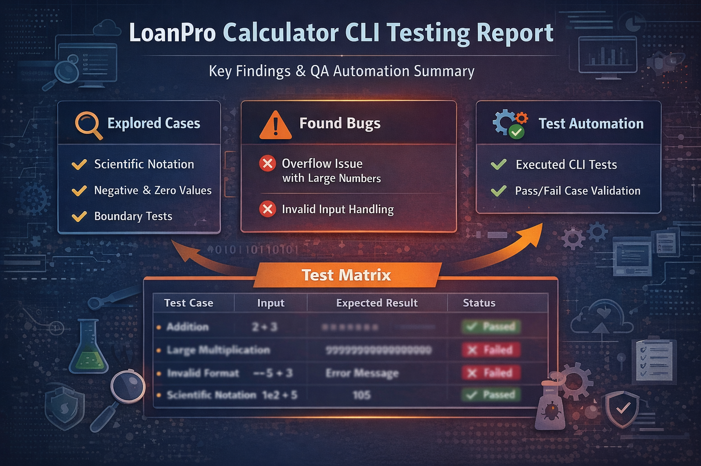

# LoanPro Calculator -- SDET Coding Challenge



## 1. Overview

This repository contains my solution to the **LoanPro SDET Coding
Challenge**. The goal of this exercise is to evaluate an existing
calculator CLI from a **Software Development Engineer in Test (SDET)**
perspective: uncovering defects, identifying quality risks, and
assessing production readiness.

The calculator is delivered as a Dockerized CLI supporting basic
arithmetic operations: `add`, `subtract`, `multiply`, and `divide`.

While unit tests already exist, this challenge focuses on **additional
testing strategies** such as exploratory testing, edge-case analysis,
automation, and CLI contract validation.

---

## Goals of the Challenge

* Use any means necessary to uncover bugs and unexpected behaviors
* Evaluate correctness, reliability, and predictability
* Think beyond happy-path testing and unit coverage

---

## Test Approach

The evaluation was performed using the following strategies## Challenge Goals

-   Use any means necessary to uncover bugs and unexpected behaviors
-   Evaluate correctness, reliability, and predictability
-   Go beyond happy-path testing and existing unit coverage

The evaluation included:

-   Functional testing of all supported operations
-   Exploratory and edge-case testing
-   Risk-based analysis focused on production usage
-   Lightweight automation using Docker and Bash
-   Validation of CLI behavior (output, errors, exit codes)

All tests were executed using the official Docker image provided in the
challenge.

------------------------------------------------------------------------

## Summary of Results

-   The calculator behaves correctly in most expected scenarios.
-   **Two real issues were identified** without forcing unrealistic
    inputs:
    1.  Silent precision loss when operating on very large numbers.
    2.  Ambiguity around supported numeric input formats.
-   No additional critical bugs were found beyond these cases.
-   Several **quality risks** were identified that could impact
    automation and integration.

------------------------------------------------------------------------

## 2. Findings vs Risks

### Findings (Observed Behavior)

-   Core arithmetic operations work correctly for standard inputs.
-   Output is plain text and unstructured.
-   Error messages are inconsistent and not machine-readable.
-   Precision rules are not explicitly documented.
-   Exit codes are not documented or clearly differentiated.

### Risks (Production Impact)

-   **Automation risk**: Fragile integration due to lack of structured
    output and exit code contract.
-   **Silent failures**: Incorrect results may go unnoticed if consumers
    rely only on stdout.
-   **Ambiguity risk**: Undefined numeric and formatting rules increase
    misuse.
-   **Scalability risk**: Adding new operations without a clear CLI
    contract increases regression risk.

------------------------------------------------------------------------

## Bug Report

Known issues explicitly listed in the challenge description
(e.g. division by zero, \>16-digit precision, NaN/Infinity) were
intentionally excluded.

| ID      | Operation     | Steps to Reproduce            | Expected Result                          | Actual Result                    | Notes                      |
| ------- | ------------- | ----------------------------- | ---------------------------------------- | -------------------------------- | -------------------------- |
| BUG-001 | multiply      | `multiply 9999999999999999 2` | Error or warning about precision loss    | Rounded but valid-looking result | Silent precision loss      |
| BUG-002 | input parsing | `add --5 3`, `add +-5 3`      | Clear documentation of supported formats | Generic error without guidance   | Ambiguous numeric contract |


### Bug 1 – Silent overflow in multiplication

**Command**

```bash
docker run --rm public.ecr.aws/l4q9w4c5/loanpro-calculator-cli multiply 9999999999999999 2
```

**Observed result**

```
Result: 20000000000000000
```

**Expected behavior**  
An explicit error or at least a warning indicating a loss of precision.

**Impact**

- The output looks valid but is mathematically incorrect.
- This type of issue can easily go unnoticed in production.

**Severity**: High

**Possible cause / hint**

The calculator may be relying on a numeric type or parsing strategy that loses precision when handling very large values.  
Instead of throwing an error or warning, the operation returns a rounded or truncated result that appears valid at first glance.

This suggests that:
- Large numbers may be implicitly converted to a floating-point representation.
- There is no explicit validation or guardrail for numeric limits.
- Precision loss is not being surfaced to the user.


---

### Bug 2 – Ambiguous numeric input formats

**Commands**

```bash
add --5 3
add +-5 3
```

**Observed result**

```
Error: Invalid argument. Must be a numeric value.
```

**Analysis**  
The system correctly rejects these values, but it does not clearly document which numeric formats are supported. This can lead to confusion for users or automated integrations.

**Severity**: Medium

**Possible cause / hint**

Input validation appears to reject ambiguous numeric formats, but the rules for accepted formats are not clearly defined or documented.

This could indicate that:
- The CLI relies on a strict numeric parser without explicit user-facing guidance.
- Some edge formats are caught by validation, but others may behave inconsistently.
- Consumers of the CLI may not know which numeric representations are officially supported.

---

## 3. Improvement areas

These points are not current bugs, but they represent real quality risks:

- The output format (`Result: X`) is not defined as a stable contract.
- There is no machine-readable output option.
- Exit codes are not documented.

## Exit Codes & CLI Contract Testing

### Current State

* Exit codes are not documented
* Success and failure cases may return the same exit code
* Consumers must rely on stdout parsing, which is fragile

### Recommended Exit Code Contract

| Exit Code | Meaning                    |
| --------- | -------------------------- |
| 0         | Success                    |
| 1         | Invalid input              |
| 2         | Unsupported operation      |
| 3         | Arithmetic error           |
| 4         | System or unexpected error |

### Example Contract Test

```bash
docker run --rm loanpro-calculator-cli add 1 1
echo $?  # Expected: 0
```

```bash
docker run --rm loanpro-calculator-cli add 1 one
echo $?  # Expected: non-zero
```

Defining and validating this contract would significantly improve reliability and integration safety.

---

## What I Would Test Next (Production Scenario)

If this calculator were preparing for production use, I would extend testing in the following areas:

* Fuzz testing with randomized numeric inputs
* Stress and repeated execution tests
* Backward compatibility testing between versions
* Locale and environment variation testing
* Observability (stderr vs stdout, verbose/debug modes)

---

## 4. Explored test cases (including non-bug scenarios)

In addition to the issues found, multiple scenarios were tested to better understand the system’s overall behavior and ensure there were no hidden failures. While many of these cases did not reveal bugs, they help increase confidence in the product and document what was evaluated.

Examples of explored tests include:

- Basic arithmetic operations (add, subtract, multiply, divide)
- Negative numbers
- Mixed integers and decimals
- Very small and very large values
- Invalid inputs (strings, ambiguous formats)
- Known scenarios described in the challenge (to confirm expected behavior)

Below is the full test matrix of executed cases.

| ID    | Category    | Case                        | Result              |
|-------|-------------|-----------------------------|---------------------|
| TC-01 | Functional  | add 2 3                     | OK                  |
| TC-02 | Functional  | subtract 5 3                | OK                  |
| TC-03 | Functional  | multiply 4 5                | OK                  |
| TC-04 | Functional  | divide 10 2                 | OK                  |
| TC-05 | Edge        | multiply 9999999999999999 2 | FAIL                |
| TC-06 | Input       | add a b                     | OK                  |
| TC-07 | Input       | add --5 3                   | FAIL                |
| TC-08 | Input       | add +-5 3                   | FAIL                |
| TC-09 | Negative    | divide -10 -2               | OK                  |
| TC-10 | Precision   | add 0.1 0.2                 | OK                  |
| TC-11 | Exploratory | add 1e2 5                   | OK                  |
| TC-12 | Exploratory | subtract -5 -3              | OK                  |
| TC-13 | Exploratory | divide 1 0                  | OK (expected error) |

## Other scenarios explored

In addition to the table above, the following inputs were explored and did not result in bugs:
- Scientific notation (e.g., `add 1e2 5`)
- Mixed float and integer values
- Negative inputs in combinations
- Division by zero with appropriate messaging
These reinforce the stability of expected behavior while documenting the scope of testing.

---

## 5. Automation

The goal of automation here is not only to detect current bugs, but to provide a baseline test suite that can catch regressions if the CLI behavior changes in the future.

Since the product is delivered as a Docker image and the source code is not available, automation was implemented at the CLI level using Bash, testing the system exactly as a user or CI pipeline would.

### Structure

```text
loanpro-sdet-challenge/
├── README.md
├── tests/
│   └── cli-tests.sh
```

### Test script

The automation is implemented as a simple Bash script that executes the Docker image directly, validating the CLI behavior exactly as a user or CI pipeline would.

The script includes:
- Core functional scenarios
- Edge cases and risky inputs
- Clear output explaining why each test exists and what risk it covers

You can find the full script here:

👉 **[`tests/cli-tests.sh`](tests/cli-tests.sh)**

### How to run the tests

```bash
chmod +x tests/cli-tests.sh
./tests/cli-tests.sh
```
---

## 6. Repository setup and commits

```bash
git init
git add README.md
git commit -m "Initial findings and quality assessment"

git add tests/cli-tests.sh
git commit -m "Add basic CLI automation tests"
```

---

## 7. Closing thoughts

This exercise reflects a practical testing approach:

- Real bugs were found without forcing unrealistic scenarios.
- Quality risks affecting maintainability and automation were identified.
- Simple but effective automation was implemented.

---

## Final Notes

This challenge was approached not only to identify bugs, but to evaluate the calculator as a production-ready tool. The focus was on correctness, predictability, and long-term maintainability from an SDET perspective.

The intent is to demonstrate how testing can reduce risk, not just validate functionality.

This is the type of work I would expect to complete before releasing a component to production.
